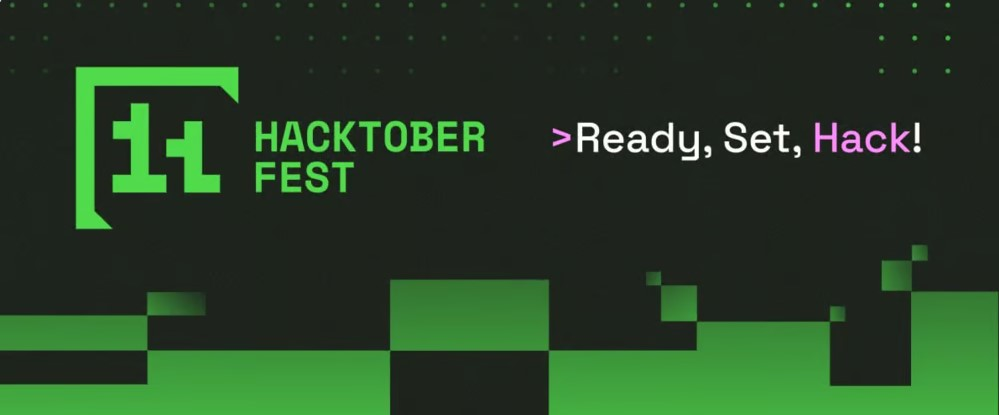

# Hacktoberfest 2024

## Gojirun

Gojirun is a 2D platformer game inspired by the classic T-Rex run from Chrome. The game is made with SVG assets built in React JS. This project is dedicated to Hacktoberfest 2024 and all its contributors.

## How to contribute

Read more:
[Contributing.md](/Contributing.md)

> [!TIP]
> Make sure you to make a pull request from the branch created under the issues listed in the project.
> Create a pull request based on the branch created so we can track the pull request in reference to the issue number

## Share Your Thoughts!

We’d love to hear your thoughts! If you have any ideas, feedback, or even just want to let us know how we’re doing, feel free to open an issue or drop us a message. Your feedback is greatly appreciated and helps improve the project!

## Contributors

## License

This project is licensed under the MIT License - see the [LICENSE.md](LICENSE.md) file for details.

## Acknowledgments

We will create a section on the website to acknowledge the contributions in making of Gojirun.
