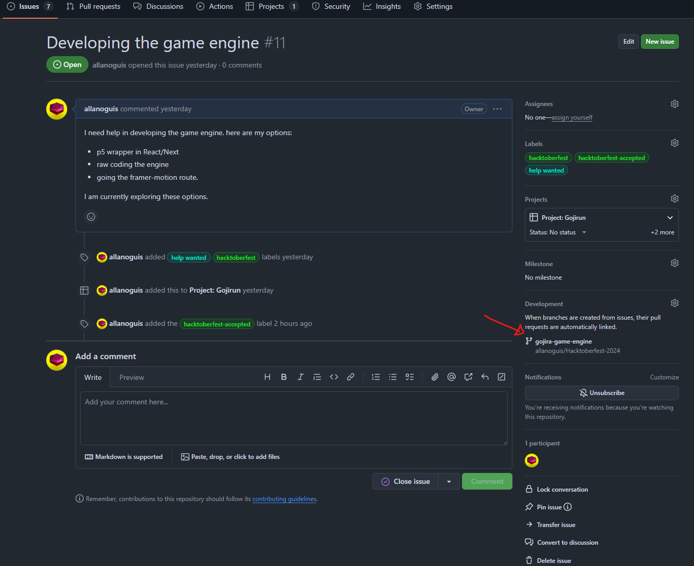

# Hacktoberfest 2024

## Gojirun

Gojirun is a 2D platformer game inspired by the classic T-Rex run from Chrome. The game is made with SVG assets built in React JS. This project is dedicated to Hacktoberfest 2024 and all its contributors.

## How to contribute

Read more:
[Contributing.md](/Contributing.md)

> [!TIP]
> Make sure you to make a pull request from the branch created under the issues listed in the project.
> Create a pull request based on the branch created so we can track the pull request in reference to the issue number

## License

This project is licensed under the MIT License - see the [LICENSE.md](LICENSE.md) file for details.

## Acknowledgments

We will create a section on the website to acknowledge the contributions in making of Gojirun.
